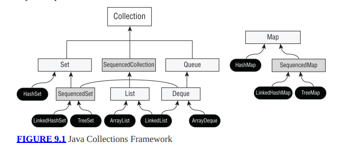
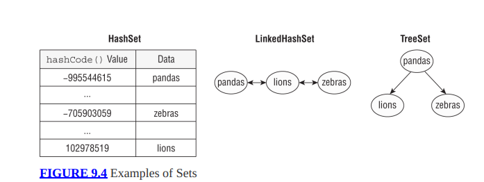

# 1 Tổng quan Collections API
- Các nhóm chính: List, Set, Queue/Deque, Map


# 2 List
- Các triển khai phổ biến:
- ArrayList: nhanh khi truy cập phần tử, chậm khi chèn/xóa ở giữa.
- LinkedList: nhanh khi chèn/xóa, chậm khi truy cập ngẫu nhiên.
### Các phương thức quan trọng:
- add(E e) – thêm phần tử.
- add(int index, E e) – thêm vào vị trí cụ thể.
- remove(Object o) hoặc remove(int index) – xóa phần tử.
- get(int index) – lấy phần tử theo vị trí.
- set(int index, E e) – cập nhật phần tử.
- size() – trả về số lượng phần tử.
- contains(Object o) – kiểm tra tồn tại.

# 3 Set
- Không cho phép phần tử trùng lặp.
- Không đảm bảo thứ tự (trừ một số triển khai đặc biệt).
- HashSet: ko đảm bảo thứ tự, dựa trên hash
- LinkedHashSet: giữ thứ tự chèn
- TreeSet: sắp xếp theo thứ tự tự nhiên hoặc Comparator.


### Các phương thức quan trọng
- add(E e) – thêm phần tử.
- remove(Object o) – xóa phần tử.
- contains(Object o) – kiểm tra tồn tại.
- size() – số lượng phần tử.
- isEmpty() – kiểm tra rỗng.
- clear() – xóa tất cả phần tử.

# 4 Queue và Deque
- Queue: FIFO (First-In-First-Out).
- Deque (Double-Ended Queue): Cho phép thêm/xóa phần tử ở cả hai đầu (có thể hoạt động như Stack hoặc Queue).
- ArrayDeque (thường dùng nhất, nhanh hơn LinkedList).
- LinkedList (cũng triển khai Queue và Deque).
### Các phương thức quan trọng
- offer(E e) – thêm phần tử vào cuối hàng đợi.
- poll() – lấy và xóa phần tử đầu hàng đợi.
- peek() – xem phần tử đầu hàng đợi nhưng không xóa.
- Với Deque:
- addFirst(E e), addLast(E e)
- removeFirst(), removeLast()
- peekFirst(), peekLast()
- Vi du
```java

import java.util.*;

public class QueueDequeExample {
   public static void main(String[] args) {
       // Queue (FIFO)
       Queue<String> queue = new ArrayDeque<>();
       queue.offer("Java");        // Queue: [Java]
       queue.offer("OCP");         // Queue: [Java, OCP]
       queue.offer("Collections"); // Queue: [Java, OCP, Collections]
       
       System.out.println("Queue ban đầu: " + queue);
       // Kết quả: [Java, OCP, Collections]
       
       System.out.println("Lấy phần tử đầu (poll): " + queue.poll());
       // Trả về: Java, Queue sau khi poll: [OCP, Collections]
       
       System.out.println("Queue sau poll: " + queue);
       // Kết quả: [OCP, Collections]
   }
```
- Dùng Deque như Stack:
    - void push(E e): Thêm vào đầu (top)
    - E pop() : Xóa và trả về phần tử đầu
    - E peek() : Xem phần tử đầu
```java

import java.util.*;

public class DequeAsStack {
   public static void main(String[] args) {
       Deque<String> stack = new ArrayDeque<>();
       
       // Thêm phần tử vào stack (push)
       stack.push("Java");        // Stack: [Java]
       stack.push("OCP");         // Stack: [OCP, Java]
       stack.push("Generics");    // Stack: [Generics, OCP, Java]
       
       System.out.println("Stack ban đầu: " + stack);
       // Kết quả: [Generics, OCP, Java]
       
       // Xem phần tử đầu (peek)
       System.out.println("Phần tử trên cùng (peek): " + stack.peek());
       // Trả về: Generics, Stack vẫn là [Generics, OCP, Java]
       
       // Xóa phần tử đầu (pop)
       System.out.println("Lấy và xóa phần tử trên cùng (pop): " + stack.pop());
       // Trả về: Generics, Stack sau khi pop: [OCP, Java]
       
       System.out.println("Stack sau pop: " + stack);
       // Kết quả: [OCP, Java]
   }
}
```
# 5 Map
- Map là một interface trong Java Collections Framework, key-value:
- Key: duy nhất (không trùng lặp).
- Value: có thể trùng lặp.
- Không thuộc Collection trực tiếp, nhưng rất quan trọng.
- HashMap: không đảm bảo thứ tự.
- LinkedHashMap: giữ thứ tự chèn.
- TreeMap: sắp xếp theo thứ tự tự nhiên của key hoặc Comparator.
###  Các phương thức quan trọng
- put(K key, V value) – thêm hoặc cập nhật giá trị.
- get(Object key) – lấy giá trị theo key.
- remove(Object key) – xóa theo key.
- containsKey(Object key) – kiểm tra key tồn tại.
- containsValue(Object value) – kiểm tra value tồn tại.
- keySet() – trả về tập hợp các key.
- values() – trả về tập hợp các value.
- entrySet() – trả về tập hợp các cặp key-value.
# 6  Comparable và Comparator
### Comparable
- Interface cho phép đối tượng tự định nghĩa cách so sánh.
- Dùng cho thứ tự tự nhiên (natural ordering).
- Object implement Comparable -> compareTo(T o)
```java
class Student implements Comparable<Student> {
  ...
   @Override
   public int compareTo(Student other) {
       return this.name.compareTo(other.name); // Sắp xếp theo tên
   }
}

public class ComparableExample {
   public static void main(String[] args) {
       List<Student> students = ...
       Collections.sort(students); // Dùng compareTo
              System.out.println("Sắp xếp theo tên: " + students);
   }
```
### Comparator
- Interface cho phép tạo logic so sánh bên ngoài đối tượng.
```java
class Student {
 String name;
 int score;
 ...
}

public class ComparatorExample {
 public static void main(String[] args) {
   List<Student> students = ...

   // Sắp xếp theo điểm giảm dần
   students.sort(Comparator.comparingInt((Student s) -> s.score).reversed());
   System.out.println("Sắp xếp theo điểm giảm dần: " + students);
 }
```
- Các phương thức tiện ích trong Comparator
- Comparator.comparing(...)
- thenComparing(...)
- reversed()
```java
students.sort(Comparator.comparing(Student::getName);
```
# 7 Sequenced Collections (Java 21)
- là một cải tiến mới trong Collections Framework, giúp làm việc với thứ tự phần tử dễ dàng hơn.
-  Các interface mới: SequencedCollection, SequencedSet, SequencedMap

### 7.1 SequencedCollection
- Áp dụng cho các collection có thứ tự (ví dụ: List, LinkedHashSet).
- Thêm các phương thức:
- getFirst(), getLast() – lấy phần tử đầu/cuối.
- addFirst(E e), addLast(E e) – thêm phần tử vào đầu/cuối.
- removeFirst(), removeLast() – xóa phần tử đầu/cuối.
- reversed() – trả về view đảo ngược, không thay đổi collection ban đầu
- không có lấy theo index
- Ví dụ: SequencedCollectionExample.java
### SequencedSet
- Cho các Set có thứ tự (ví dụ: LinkedHashSet).
### SequencedMap
- Cho các Map có thứ tự (ví dụ: LinkedHashMap).
- Thêm các phương thức:
- firstEntry(), lastEntry()
- pollFirstEntry(), pollLastEntry()
- reversed()
# 8 Tổng quan các loại Collection và khi nào dùng loại nào
- List     → ordered, duplicates allowed
- Set      → no duplicates
- Map      → key unique
- Hash*    → hash table → unordered
- Linked*  → insertion order
- Tree*    → sorted
- HashSet uses: hashCode() + equals()
- TreeSet / TreeMap require: Comparable OR Comparator
- PriorityQueue: sorted but iteration order unpredictable
```java
ArrayList   → fast read
LinkedList  → fast insert
HashSet     → unique
TreeSet     → sorted
HashMap     → key-value
TreeMap     → sorted map
```
JAVA COLLECTIONS

 Iterable
   └── Collection

        ├── List (ordered, duplicates allowed)
        │
        │   ├── ArrayList
        │   │      • dynamic array
        │   │      • fast random access
        │   │      • slow insert middle
        │   │
        │   ├── LinkedList
        │   │      • doubly linked list
        │   │      • fast insert/delete
        │   │      • slow access
        │   │
        │   └── Vector (legacy)

        ├── Set (no duplicates)
        │
        │   ├── HashSet
        │   │      • unordered
        │   │      • uses hashCode + equals
        │   │
        │   ├── LinkedHashSet
        │   │      • insertion order
        │   │
        │   └── TreeSet
        │          • sorted
        │          • Comparable / Comparator
        │          • no null

        └── Queue
             │
             ├── PriorityQueue
             │      • sorted by priority
             │
             └── Deque
                    └── ArrayDeque
                           • stack + queue
                           • very fast


 Map (NOT part of Collection)

        ├── HashMap
        │      • key unique
        │      • 1 null key
        │
        ├── LinkedHashMap
        │      • insertion order
        │
        ├── TreeMap
        │      • sorted by key
        │      • no null key
        │
        └── Hashtable (legacy)

# 8.1 Null value contain - Quick Memory Trick (OCP)
## 1️⃣ List
All **List implementations allow null**
- ArrayList → null allowed
- LinkedList → null allowed
- Vector → null allowed
---
## 2️⃣ Hash-based collections
Allow **one null element**
- HashSet → one null
- LinkedHashSet → one null
---
## 3️⃣ Tree-based collections
No **null allowed**
- TreeSet → ❌ null not allowed
- TreeMap → ❌ null key not allowed (value can be null)
Reason: Tree structures require **comparison**, and `null` cannot be compared.
---
## 4️⃣ Queue / Deque
No **null allowed**
- PriorityQueue → ❌ null not allowed
- ArrayDeque → ❌ null not allowed
Reason: `null` is used as a **special return value** in queue operations.
Example:

```java
Queue<Integer> q = new LinkedList<>();
q.poll();  // returns null if queue is empty
```
#  9: Generics và Wildcards
- cực kỳ quan trọng cho kỳ thi OCP và cũng rất hữu ích trong thực tế vì nó giúp viết mã an toàn kiểu (type-safe) và tái sử dụng.

### Generics là gì?
- định nghĩa kiểu dữ liệu tổng quát cho class, interface hoặc method
- Lợi ích:
- Type-safety: tránh lỗi ép kiểu runtime.
- Reuse code: một class/method có thể dùng cho nhiều kiểu dữ liệu.
- ví dụ:
```java

List<String> list = new ArrayList<>();
list.add("Java");
// list.add(123); // Lỗi compile-time , tránh lỗi runtime
```
### Generic Class
```java

class Box<T> {
   private T value;
   public void set(T value) { this.value = value; }
   public T get() { return value; }
}
```
###  Generic Method
```java
public static <T> void printArray(T[] array) {
   for (T element : array) {
       System.out.println(element);
   }
}
```
### Wildcards trong Generics
- Wildcards giúp linh hoạt khi làm việc với kiểu generic chưa biết chính xác.
- Các loại Wildcards:
- ? – kiểu bất kỳ.
- ? extends T – kiểu bất kỳ kế thừa T (upper bound).
- ? super T – kiểu bất kỳ là T hoặc cha của T (lower bound).
- Ví dụ:
```java
List<? extends Number> list1; // Chấp nhận List<Integer>, List<Double>
```
- Quy tắc PECS (Producer Extends, Consumer Super)
- Producer Extends: Nếu bạn đọc dữ liệu → dùng ? extends.
- Consumer Super: Nếu bạn ghi dữ liệu → dùng ? super.
### Diamond Operator (<>)
- Giúp trình biên dịch suy luận kiểu dữ liệu khi khởi tạo đối tượng Generic, tránh việc phải lặp lại kiểu ở cả hai bên
- Không thể dùng khi khai báo kiểu không rõ ràng (ví dụ với anonymous class)
```java
Map<Integer, String> map = new HashMap<>();
```
```java
Map<String, String> map = new HashMap<>() { };
      // Lỗi nếu không chỉ rõ kiểu trong anonymous class
```

### List "<  Object>" vs "List<?>"
- 'List< Object>:
- Danh sách chứa các phần tử kiểu Object.
- Có thể thêm bất kỳ đối tượng nào vào danh sách này (vì mọi class đều kế thừa từ Object).
- Nhưng: Không thể gán List<String> cho List<Object> vì Generics không hỗ trợ covariance.
-  dùng khi bạn muốn thêm nhiều kiểu khác nhau vào danh sách
```java
List<Object> list = new ArrayList<>();
list.add("Java");      // OK
list.add(123);         // OK
```
```java
List<String> strings = new ArrayList<>();
List<Object> objects = strings; // Lỗi compile-time
```
- List<?>:
- Nghĩa là danh sách chứa phần tử kiểu bất kỳ (unknown type).
- Bạn không thể thêm phần tử (ngoại trừ null) vì không biết kiểu thực sự là gì.
- Có thể đọc phần tử dưới dạng Object.
-  thường dùng khi bạn chỉ đọc dữ liệu từ danh sách mà không quan tâm kiểu cụ thể.
- .
```java
List<?> unknownList = new ArrayList<String>();
unknownList.add("Java"); // Lỗi compile-time
unknownList.add(null);   // OK
```
### Appendix
| Method                                 | Modifiable? | Size Change Allowed? | Is It a Real Copy? | Reflects Changes to Original? | Notes |
|----------------------------------------|-------------|-----------------------|---------------------|--------------------------------|-------|
| Collections.unmodifiableList(list)     | ❌ No       | ❌ No                | ❌ No (view only)   | ✔ Yes                          | Read-only view; changes in original are visible |
| List.copyOf(list)                      | ❌ No       | ❌ No                | ✔ Yes (snapshot)    | ❌ No                          | True unmodifiable copy (Java 10+) |
| List.of(...)                           | ❌ No       | ❌ No                | ✔ Snapshot          | ❌ No                          | Does NOT track outside changes |
| new ArrayList<>(list)                  | ✔ Yes       | ✔ Yes                | ✔ Yes              | ❌ No                          | Fully independent, modifiable |
| new LinkedList<>(list)                 | ✔ Yes       | ✔ Yes                | ✔ Yes              | ❌ No                          | Fully independent copy |
| Arrays.asList(array)                   | ✔ Yes (set) | ❌ No (fixed size)    | ❌ No (backed array) | ✔ Yes                         | Updates reflect array changes |
| new ArrayList<>(Arrays.asList(array))  | ✔ Yes       | ✔ Yes                | ✔ Yes              | ❌ No                          | Independent from original array |
| Set.copyOf(collection)                 | ❌ No       | ❌ No                | ✔ Yes              | ❌ No                          | Snapshot like List.copyOf |
| Map.copyOf(map)                        | ❌ No       | ❌ No                | ✔ Yes              | ❌ No                          | Snapshot |
