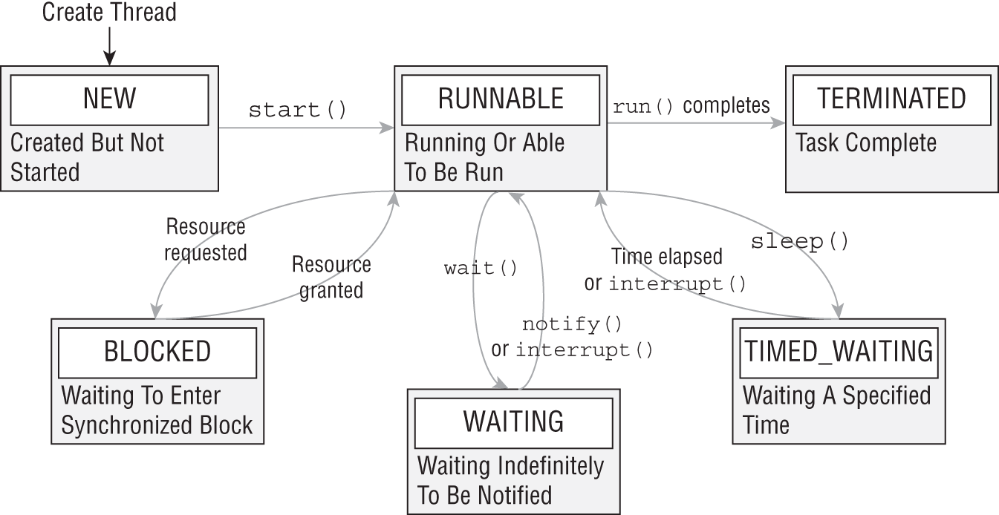
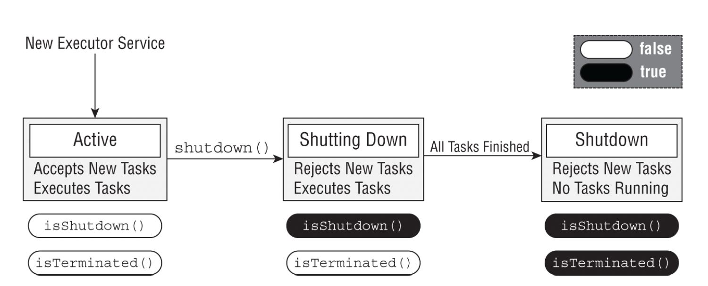

# 1 Introducing Threads

- A thread: smallest of execution that can be scheduled by the OS
- A process: a group of associated thread
- Virtual thread: best for waiting I/O or network resources
  - Each time the virtual thread is ready to run, it waits for a carrier thread to be available


## Understanding Thread Concurrency
- Concurrency = nhiều thread cùng tồn tại (chạy // hoặc có vẻ //)
- Scheduler chọn thread chạy (priority khng đảm báo thứ tự)
- Context switch có chi phí -> tốn thời gian, giảm performance 
## Creating a Thread
```java
Thread.ofPlatform().start(() -> System.out.print("Hello"));
System.out.print("World"); 
// Output không xác định: HelloWorld hoặc WorldHello
```
### Thread Builder: ofPlatform()/ofVirtual() trả về Thread.Builder
### start() vs unstarted(): 
  - start() → chạy ngay
  - unstarted() → chạy sau
```java
Thread t = Thread.ofVirtual().unstarted(task);
// làm việc khác
t.start();
```
### Asynchronous vs Synchronous
- Thread.start() → asynchronous  -> Main thread không chờ
- join() → Bắt main thread đợi các thread khác kết thúc
  - có thể throw InterruptedException
  - không làm thread chạy sớm hơn
```java
t.join(); // main thread bị block
```
### Bẫy rất hay thi: run() vs start()
```java
new Thread(task).run(); // task chạy synchronously nhưng KHÔNG tạo thread mới
```
- ❗ Luôn phải gọi start() để tạo thread mới
## Daemon Threads
- là thread không ngăn JVM kết thúc / is one that does not prevent JVM from exiting when the program finishes 
- JVM sẽ kết thúc khi : chỉ còn daemon thread đang chạy 
- Daemon thread quen thuộc: GC, background monitoring thread 
- Virtual threads luôn là daemon
- Platform thread: Mặc định NON-daemon
- Quy tắc sống còn (cần thuộc lòng): user thread còn sống -> JVM chưa kết thúc; chỉ còn daemon thread -> JVM kết thúc ngay 
- Daemon thread có thể bị kill giữa chừng -> Không đảm bảo: finally block chạy , dữ liệu được flush
- setDaemon() phải gọi TRƯỚC start
```java
Thread t = new Thread(task);
t.start();
t.setDaemon(true); // ❌ IllegalThreadStateException
```
## Thread’s Life Cycle
### States 


| State | Ý nghĩa |
|-----|--------|
| **NEW** | Thread vừa được tạo, **chưa gọi `start()`** |
| **RUNNABLE** | Thread **có thể chạy** (đang chạy hoặc đang chờ CPU) |
| **BLOCKED** | Đang chờ **monitor lock** (do `synchronized`) |
| **WAITING** | Đang chờ **vô thời hạn** |
| **TIMED_WAITING** | Đang chờ **có giới hạn thời gian** |
| **TERMINATED** | Thread đã kết thúc hoặc bị exception không bắt |

- Hiểu đúng trạng thái RUNNABLE (BẪY OCP): không có nghĩa là đang chạy - Thread sẵn sàng chạy khi scheduler cấp CPU
- Các trạng thái tạm dừng:

  | State             | Nguyên nhân phổ biến       |
  | ----------------- | -------------------------- |
  | **BLOCKED**       | Chờ lock (`synchronized`)  |
  | **WAITING**       | `wait()`, `join()`         |
  | **TIMED_WAITING** | `sleep()`, `join(timeout)` |

  - Đặc điểm chung: 
    - không sử dụng CPU.
    - ⏱ TIMED_WAITING: vẫn theo dõi bộ đếm thời gian

### interrupt() – Phần RẤT HAY THI
- 1️⃣ interrupt() khi thread đang WAITING hoặc TIMED_WAITING: 
  - Dừng sleep/wait 
  - Throws InterruptedException 
  - Thread quay về RUNNABLE 
- 2️⃣ interrupt() khi thread đang RUNNABLE: 
  - ko throw exception 
  - Chỉ set interrupt flag 
  - Thread phải tự kiểm tra 
```java
if (Thread.interrupted()) {
    System.out.println("Someone interrupted us!");
}
```
### IllegalThreadStateException
- xảy ra khi gọi operation không hợp lệ trên thread 
- Ví dụ: 
  - thao tác sai vòng đời thread
  - Gọi phương thức không được phép trong trạng thái hiện tại
# 2 Creating Threads with the Concurrency API
## 2.1 Single-Thread Executor
- `ExecutorService` – interface dùng để:
  - tạo thread
  - quản lý vòng đời thread
  - gửi và thực thi task

- Khuyến nghị OCP
> Bất cứ khi nào cần chạy task song song (kể cả chỉ 1 thread), **hãy dùng Concurrency API**, không tự tạo thread thủ công.
 
- ExecutorService: 
  - Là **interface**
  - Không khởi tạo trực tiếp bằng `new`
  - Được tạo thông qua **factory class `Executors`**

- Single-Thread Executor
```java
// Tạo ExecutorService
ExecutorService service = Executors.newSingleThreadExecutor();
```
  - Chỉ có 1 worker thread
    - Các task được:
      - xếp hàng
      - chạy tuần tự
    - Không có hai task chạy song song trong executor này
- OCP hay hỏi: 
  - 1️⃣ Task chạy tuần tự 
    - Với newSingleThreadExecutor():
      - task không bị xen kẽ 
      - vòng for chạy trọn vẹn trước khi task tiếp theo chạy
  - 2️⃣ Main thread không bị block:
    - service.execute() là asynchronous 
    - main() tiếp tục chạy ngay
- The ExecutorService interface in Java implements the AutoCloseable
## 2.2 Submitting Tasks
| Method           | Blocking? | Trả về          | Dùng khi          |
| ---------------- | --------- | --------------- | ----------------- |
| execute()        | ❌         | void            | Không cần kết quả |
| submit(Runnable) | ❌         | Future<?>       | Theo dõi task     |
| submit(Callable) | ❌         | Future<T>       | Cần kết quả       |
| invokeAll()      | ✅         | List<Future<T>> | Chờ tất cả        |
| invokeAny()      | ✅         | T               | Chỉ cần 1 kết quả |
- TIP cho OCP : 
  - Thi: cần biết cả execute() và submit() 
  - Thực tế: ưu tiên dùng submit() vì: 
    - Hỗ trợ Callable 
    - có return value 
    - Theo dõi trạng thái task 

## 2.3 Waiting for Results 
### Future
- Future cho phép:
  - Kiểm tra task đã xong hay chưa 
  - Hủy task 
  - Chờ và lấy kết quả
- Future methods:

  | Method                                          | Ý nghĩa                                                            |
  | ----------------------------------------------- | ------------------------------------------------------------------ |
  | `boolean isDone()`                              | `true` nếu task đã xong, ném exception, hoặc bị cancel |
  | `boolean isCancelled()`                         | `true` nếu task bị cancel trước khi hoàn thành                     |
  | `boolean cancel(boolean mayInterruptIfRunning)` | Cố gắng hủy task                                                   |
  | `V get()`                                       | Chờ vô hạn cho đến khi có kết quả                              |
  | `V get(long timeout, TimeUnit unit)`            | Chờ tối đa `timeout`, nếu chưa xong → `TimeoutException`           |

```java
import java.util.concurrent.*;

public class CheckResults {
    private static int counter = 0;

    public static void main(String[] unused) throws Exception {
        try (var service = Executors.newSingleThreadExecutor()) {

            Future<?> result = service.submit(() -> {
                for (int i = 0; i < 1_000_000; i++)
                    counter++;
            });

            result.get(10, TimeUnit.SECONDS); // chờ tối đa 10 giây
            System.out.println("Reached!");
        }
        catch (TimeoutException e) {
            System.out.println("Not reached in time");
        }
    }
}
```
### Future<?> trả về gì với Runnable?
- submit(Runnable) → trả về Future<?>
- Runnable.run() có return type là void
- ➡️ Kết luận cực kỳ hay ra đề: Future.get() LUÔN trả về null khi task là Runnable
```java
Future<?> f = service.submit(() -> {});
System.out.println(f.get()); // null
```
- Nếu muốn có giá trị trả về → dùng Callable<V>

### Polling với sleep() ❌ (KHÔNG khuyến khích)
- Polling là gì: Liên tục kiểm tra trạng thái theo chu kỳ
```java
while (!done) {
    Thread.sleep(1000);
}
```
- Nhược điểm: Tốn CPU , Code xấu , Dễ lỗi
- Cách đúng: dùng Future 
```java
future.get(); // Java lo việc chờ giúp bạn
```
## 2.4 Investigating Callable
- Nó tương tự Runnable, nhưng có 2 điểm khác biệt quan trọng:

  | Runnable                      | Callable                           |
  | ----------------------------- | ---------------------------------- |
  | `void run()`                  | `V call()`                         |
  | Không trả về giá trị          | **Có trả về giá trị**              |
  | Không throw checked exception | **Có thể throw checked exception** |
```java
@FunctionalInterface
public interface Callable<V> {
    V call() throws Exception;
}
```
- Callable + ExecutorService
```java
Future<V> submit(Callable<V> task)
```
- Callable is often preferable over Runnable because it allows more details to be retrieved easily from the task after it is completed.
- Tinh thần của Concurrency API (rất hay ra lý thuyết): 
  - Ko tự quản lý thread -> Dùng ExecutorService 
  - không dùng wait()/notify() 
  - không polling bằng sleep() -> Dùng Future
  - Dùng Callable (prefer over Runnable)

## 2.5 Shutting Down a Thread Executor
- luôn đóng ExecutorService để tránh chương trình “chạy mãi không dừng”
```java
try (var service = Executors.newSingleThreadExecutor()) {
    service.submit(() -> System.out.println("Done"));
}
```
- Khi thoát try:
  - close() được gọi tự động
  - close() ⇒ gọi shutdown()
  - Chờ tất cả task chạy xong
  - JVM được phép thoát
  -  Cách này an toàn nhất, nên dùng nếu có thể
  - Nếu ko gọi shutdown, Thread non-daemon do ExecutorService tạo ra sẽ ngăn JVM exiting 
- ExecutorService states:
- 
  | Scenario          | Description                                                         | More tasks allowed | isShutdown() | isTerminated()                                            |
  | ----------------- | ------------------------------------------------------------------- | ------------------ | ------------ | --------------------------------------------------------- |
  | Active        | Executor đang chạy bình thường, nhận task mới                       | Yes            | `false`      | `false`                                                   |
  | shutdown()    | Không nhận task mới; các task đang chờ / đang chạy chạy đến hết | No             | `true`       | `false` (khi task còn chạy)<br>`true` (khi task xong hết) |
  | close()       | Gọi `shutdown()` và chờ cho tất cả task kết thúc (Java 19+)     | No             | `true`       | `true`                                                    |
  | shutdownNow() | Cố gắng dừng task đang chạy (interrupt) và hủy task đang chờ        | No             | `true`       | `false` (khi task còn chạy)<br>`true` (khi task xong hết) |


## 2.6 Scheduling Tasks 
- Khi nào cần Scheduling Tasks?
  - Khi bạn muốn: 
    - Chạy 1 task trong tương lai
    - Hoặc chạy lặp lại theo chu kỳ
- Thread Executor Lifecycle: 


- ScheduledExecutorService là gì?
  - Là subinterface của ExecutorService
```java
ScheduledExecutorService service =
    Executors.newSingleThreadScheduledExecutor();

Runnable task1 = () -> System.out.println("Hello Zoo");
ScheduledFuture<?> r1 =
        service.schedule(task1, 10, TimeUnit.SECONDS);
```
| Tiêu chí        | scheduleAtFixedRate | scheduleWithFixedDelay    |
| --------------- | ------------------- | ------------------------- |
| Dựa vào         | Thời gian bắt đầu   | Thời gian kết thúc        |
| Task mới tạo    | Theo lịch           | Sau khi task cũ xong      |
| Có thể dồn task | ❌ Có                | ✅ Không                   |
| Phù hợp         | Công việc theo giờ  | Công việc theo trạng thái |

```java
service.scheduleAtFixedRate(task, 5, 1, TimeUnit.MINUTES);
// Chờ 5 phút
// Sau đó cứ mỗi 1 phút nộp task mới
// Không quan tâm task cũ đã xong hay chưa
```
- Minh hoạ:

  | Thời điểm | Sự kiện            |
  | --------- | ------------------ |
  | 12:00     | Task 1 bắt đầu     |
  | 12:01     | Task 2 được submit |
  | 12:02     | Task 3 được submit |


```java
service.scheduleWithFixedDelay(task, 0, 2, TimeUnit.MINUTES);
// Task chạy xong
// Chờ thêm 2 phút
// Rồi mới chạy tiếp
```
- Minh hoạ

  | Task chạy lúc | Thời gian chạy | Lần tiếp theo |
  | ------------- | -------------- | ------------- |
  | 12:00         | 5 phút         | 12:07         |
  | 12:07         | 3 phút         | 12:12         |

## 2.7 Increasing Concurrency with Pools 
- Thread pool = nhóm thread tạo sẵn, tái sử dụng

  | Method name                          | Return type                | Description (ý chính)                                       |
  | ------------------------------------ | -------------------------- | ----------------------------------------------------------- |
  | `newSingleThreadExecutor()`          | `ExecutorService`          | **1 platform thread**, chạy **tuần tự**, task xếp hàng      |
  | `newSingleThreadScheduledExecutor()` | `ScheduledExecutorService` | **1 platform thread**, **schedule** task (delay / periodic) |
  | `newCachedThreadPool()`              | `ExecutorService`          | **Tạo thread khi cần**, tái sử dụng thread cũ               |
  | `newFixedThreadPool(int)`            | `ExecutorService`          | **Số thread cố định**, task dư vào queue                    |
  | `newScheduledThreadPool(int)`        | `ScheduledExecutorService` | **N thread**, **schedule** task song song                   |
  | `newVirtualThreadPerTaskExecutor()`  | `ExecutorService`          | **Mỗi task 1 virtual thread**, không dùng pool              |
- Cách nhớ nhanh: 
  - Single → 1 thread
  - Fixed → n thread cố định
  - Cached → tăng giảm linh hoạt
  - Scheduled → delay / periodic
  - Virtual → mỗi task 1 thread
