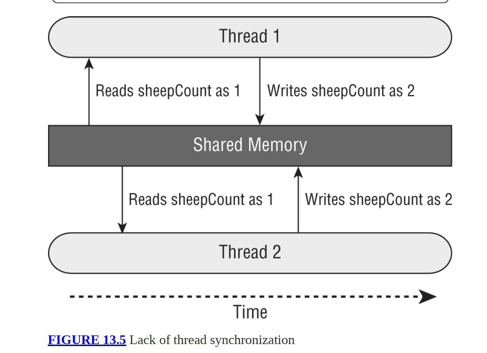
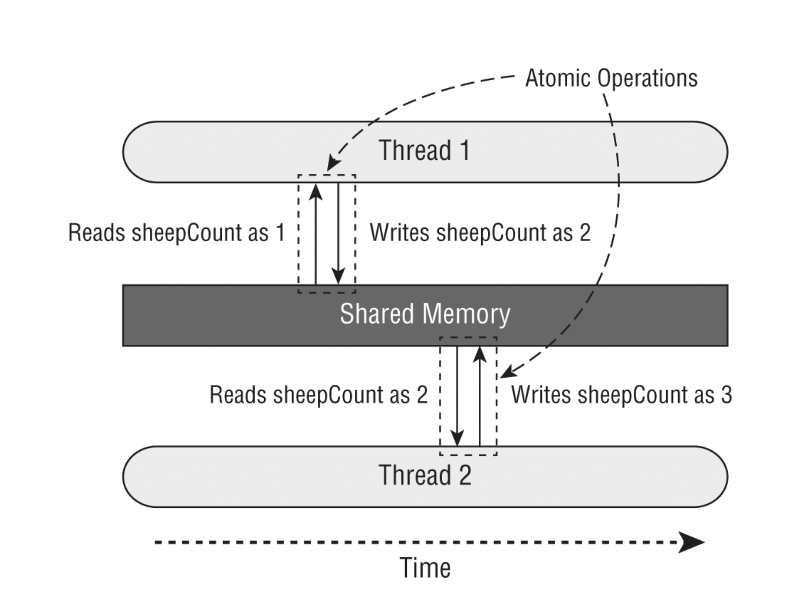

# 1. Thread-safe là gì?
- Là khả năng cho phép nhiều thread truy cập cùng luúc mà dữ liệu vẫn đúng 
- Thread-safety: safe execution by multi threads at the same time 
- Race-condition: the unexpected result of multi tasks at the same time 
- ++sheepCount, sheepCount++ KHÔNG thread-safe vì:
  - Thực chất gồm 2 bước: đọc → ghi
  - 2 thread có thể đọc cùng giá trị → ghi đè kết quả
  - 
```java
private int sheepCount = 0;
private void incrementAndReport() {
  System.out.print((++sheepCount) + " ");
}

public static void main(String[] args) {
  try (var service = Executors.newFixedThreadPool(20)) {
    SheepManagerThreadSafe manager = new SheepManagerThreadSafe();
    for (int i = 0; i < 10; i++)
      service.submit(manager::incrementAndReport);
  }
}
```

# 2. volatile
- volatile đảm bảo thread **đọc giá trị mới nhất**
- Nhưng **KHÔNG** làm cho ++ trở nên atomic 
- -> không Thread-safe 
- -> volatile  không giải quyết race condition 
- ít dùng trong thực tế
# 3 Atomic Classes (RẤT QUAN TRỌNG)
- in package _java.util.concurrent.atomic_ 
- Class cần nhớ: 
  - AtomicInteger
  - AtomicLong
  - AtomicBoolean
- Vì sao dùng: thao tác atomic (đọc + ghi là 1 bước)
- ✅ Atomic đảm bảo **không mất dữ liệu**
- ❌ **KHÔNG** đảm bảo thứ tự execution
- OCP rất thích hỏi: Atomic thread-safe nhưng không ordered
- 
```java
private AtomicInteger sheepCount = new AtomicInteger(0);
    private void incrementAndReport() {
        System.out.print(sheepCount.incrementAndGet() + " ");
    }
```
# 4 synchronized – nền tảng nhất
- The most common technique is to use a monitor to synchronize access
- Chỉ 1 thread vào critical section tại 1 thời điểm
- Dùng monitor / lock
- Điều kiện bắt buộc: Mọi thread phải lock cùng 1 object
- Lỗi rất hay thi
  - ❌ Synchronized lúc submit task
  - ✔ Phải synchronized lúc execute code
```java
synchronized(obj) {
   // critical section
}
//
synchronized(this) {
    System.out.print(sheepCount.incrementAndGet() + " "); //it works
}
// 
var manager = new SheepManager();
synchronized(manager) {
    service.submit(() -> manager.incrementAndReport()); // not works
}
```
# 5. Synchronized Method
```java
synchronized void run() {}
// tương đương 
void run() {
  synchronized(this) {}
}
```
- Static synchronized: Lock trên Class object -> dùng khi cần đồng bộ tất cả instance 
```java
static synchronized void test() {}
// lock = ClassName.class
```
# 6 Lock Framework (ReentrantLock)
- package java.util.concurrent.locks 
- So với _synchronized_: 
  - Linh hoạt hơn 
  - Có tryLock()
  - Có timeout 
  - Có fairness 
- Mẫu code chuẩn về lock (hay thi): 
```java
lock.lock();
try {
   // protected code
} finally {
   lock.unlock();
}
```
- Ví dụ tryLock()
```java
var myLock = new ReentrantLock();

Thread.ofPlatform().start(() -> printHello(myLock));

if (myLock.tryLock()) {
   try {
      System.out.println("Lock obtained");
   } finally {
      myLock.unlock();
   }
} else {
   System.out.println("Unable to acquire lock");
}
```
- Quy tắc vàng: Lock bao nhiêu lần → unlock bấy nhiêu lần
- ❌ unlock() khi chưa lock → IllegalMonitorStateException
```java
lock.unlock(); // IllegalMonitorStateException
```
# 7. ReentrantReadWriteLock
- Dùng khi Đọc nhiều - Ghi ít
- Quy tắc: Nhiều thread đọc cùng lúc - 1 thread ghi 
- thực hiện khoá writeLock trước readlock 
```java
import java.util.concurrent.locks.ReentrantReadWriteLock;
var lock = new ReentrantReadWriteLock();

lock.writeLock().lock();
lock.readLock().lock();

System.out.println(lock.isWriteLocked());     // true
System.out.println(lock.getReadLockCount());  // 1

lock.writeLock().unlock();
lock.readLock().unlock();
```
- Ví dụ ❌ Ví dụ DEADLOCK (trong file)
```java
lock.readLock().lock();
lock.writeLock().lock(); // Chờ mãi mãi
```
# 8. CyclicBarrier – đồng bộ theo giai đoạn
- Dùng khi nào?
  - Nhiều thread
  - Cần chờ nhau tại các mốc
- Ý tưởng
  - Thread gọi await()
  - Đủ số lượng → tất cả cùng chạy tiếp
- Hay hỏi:
  - Barrier có thể tái sử dụng
  - Có thể truyền Runnable khi hoàn thành barrier
- Code: LionPenManager.java 
# 10. Chiến lược học cho OCP 21 (quan trọng)
- Nhớ từ khóa: race condition, atomic, monitor
- Đọc code và tự hỏi:
  - Lock ở đâu?
  - Bao nhiêu thread?
  - Có unlock không?
- Gặp ++ → nghĩ ngay NOT thread-safe